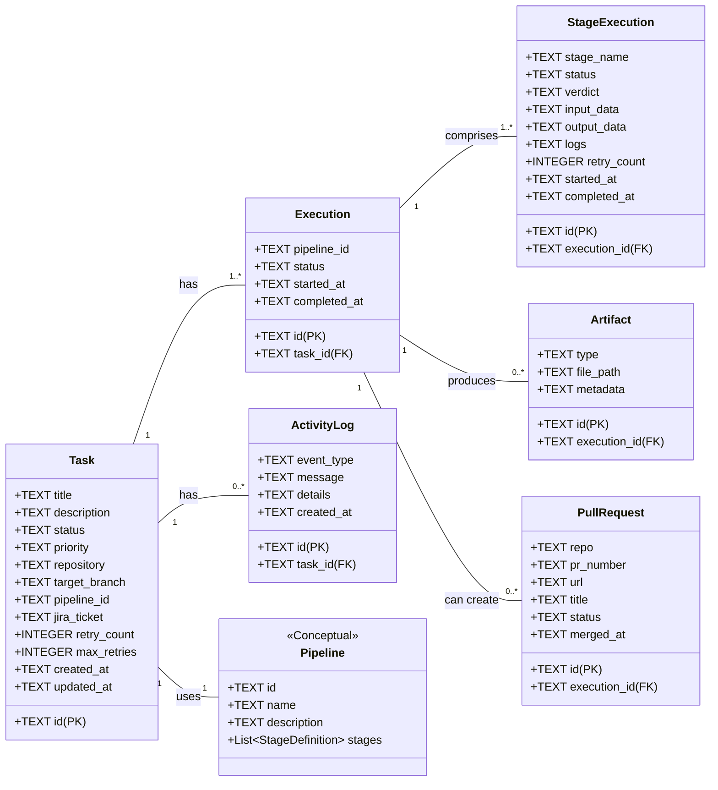

# System Data Model (Class Diagram)

This document provides a detailed overview of the core data entities (or "classes") that constitute the data model of the Agent Orchestration system. The canonical source of truth for this model is the database schema defined in `server/db.js`. This model governs the structure of all persistent data and dictates the relationships between the fundamental concepts of the application.

### Data Model Philosophy

The data model is designed to be normalized and relational, ensuring data integrity and minimizing redundancy. It revolves around the central concept of a **Task**, with all other entities branching out to describe a task's execution, its constituent steps, its outputs, and its associated metadata. The use of `TEXT`-based UUIDs as primary keys is a standard practice for distributed-friendly systems.

***

### Detailed UML Class Diagram

***

### Exhaustive Entity (Class) Descriptions

#### **Task**
-   **Description:** This is the central and most important entity in the entire system. A `Task` represents a single, high-level unit of work that a user wants the system to perform. It holds the initial intent and configuration, but not the runtime state of any specific attempt to carry it out.
-   **Attributes:**
    -   `id (TEXT, Primary Key)`: A unique identifier (UUID) for the task.
    -   `title (TEXT)`: A short, human-readable title for the task.
    -   `description (TEXT)`: A longer, more detailed description of what the task is supposed to achieve.
    -   `status (TEXT)`: The current high-level status of the task (e.g., `queued`, `running`, `completed`, `failed`). This is often a summary of the status of its most recent `Execution`.
    -   `priority (TEXT)`: The task's priority (e.g., `low`, `medium`, `high`), which could be used by the worker to decide which task to pick next.
    -   `repository (TEXT)`: The URL of the Git repository to be used for this task.
    -   `target_branch (TEXT)`: The specific branch within the repository that the task should operate on.
    -   `pipeline_id (TEXT)`: The identifier for the `Pipeline` that defines the steps to be executed for this task.
    -   `jira_ticket (TEXT)`: An optional link to an associated ticket in an external issue tracker like Jira.
    -   `retry_count (INTEGER)`: How many times the most recent execution has been retried.
    -   `max_retries (INTEGER)`: The maximum number of times an execution for this task is allowed to be retried.
-   **Relationships:**
    -   **Has many Executions:** A single `Task` can be run multiple times (e.g., initial run plus several retries). Each run is captured as a separate `Execution` record. (One-to-Many)
    -   **Has many ActivityLogs:** A `Task` has a log of high-level, human-readable events associated with it. (One-to-Many)

#### **Pipeline** (Conceptual Class)
-   **Description:** A `Pipeline` is a reusable template that defines the sequence of steps (or "stages") required to complete a `Task`. This is a conceptual entity; it is not stored in the database as a single record but is loaded by the application from configuration files (e.g., YAML).
-   **Attributes:**
    -   `id (TEXT)`: The unique identifier for the pipeline (e.g., derived from its filename).
    -   `name (TEXT)`: A human-readable name for the pipeline.
    -   `description (TEXT)`: A description of what the pipeline is for.
    -   `stages (List<StageDefinition>)`: An ordered list of stage definitions that the `Orchestration Engine` will execute.
-   **Relationships:**
    -   **Is used by Task:** A `Task` is configured to use one specific `Pipeline` to guide its execution. (Many-to-One)

#### **Execution**
-   **Description:** An `Execution` represents a single, concrete attempt to run a `Task` from start to finish. If a task is retried, a new `Execution` record is created. This entity tracks the runtime state of a single pass.
-   **Attributes:**
    -   `id (TEXT, Primary Key)`: A unique identifier (UUID) for this specific run.
    -   `task_id (TEXT, Foreign Key)`: A reference back to the parent `Task`.
    -   `pipeline_id (TEXT)`: A snapshot of the pipeline ID that was used for this specific execution.
    -   `status (TEXT)`: The current status of this specific run (e.g., `running`, `completed`, `failed`).
    -   `started_at (TEXT)`: The timestamp when this execution began.
    -   `completed_at (TEXT)`: The timestamp when this execution finished.
-   **Relationships:**
    -   **Belongs to a Task:** Every `Execution` is a child of exactly one `Task`. (Many-to-One)
    -   **Comprises many StageExecutions:** An `Execution` is made up of an ordered series of `StageExecution` records, one for each stage in the pipeline. (One-to-Many)
    -   **Produces many Artifacts:** A single `Execution` can generate zero or more `Artifacts`. (One-to-Many)
    -   **Can create many PullRequests:** A single `Execution` can result in the creation of one or more pull requests. (One-to-Many)

#### **StageExecution**
-   **Description:** This entity represents the execution of a single stage within a `Pipeline` during a specific `Execution`. It captures the inputs, outputs, logs, and verdict for that granular step.
-   **Attributes:**
    -   `id (TEXT, Primary Key)`: A unique identifier (UUID) for this specific stage run.
    -   `execution_id (TEXT, Foreign Key)`: A reference back to the parent `Execution`.
    -   `stage_name (TEXT)`: The name of the stage being executed (e.g., "clone_repo", "run_tests").
    -   `status (TEXT)`: The status of this stage (`running`, `completed`, `failed`).
    -   `verdict (TEXT)`: A summary outcome of the stage, especially if it involves analysis (e.g., "approved", "changes_requested").
    -   `input_data (TEXT)`: A serialized (e.g., JSON) representation of the data provided to the stage at its start.
    -   `output_data (TEXT)`: A serialized representation of the data produced by the stage.
    -   `logs (TEXT)`: The detailed, low-level logs generated during the execution of this stage.
-   **Relationships:**
    -   **Belongs to an Execution:** Every `StageExecution` is a part of exactly one `Execution`. (Many-to-One)

#### **Artifact**
-   **Description:** An `Artifact` is a file or a piece of data produced during an `Execution`. This could be a compiled binary, a test report, a generated code file, etc.
-   **Attributes:**
    -   `id (TEXT, Primary Key)`: A unique identifier for the artifact.
    -   `execution_id (TEXT, Foreign Key)`: A reference to the `Execution` that produced this artifact.
    -   `type (TEXT)`: A category for the artifact (e.g., `log`, `report`, `image`).
    -   `file_path (TEXT)`: The path to the artifact on the filesystem.
    -   `metadata (TEXT)`: A JSON blob for any additional metadata about the artifact.
-   **Relationships:**
    -   **Is produced by an Execution:** An `Artifact` is a result of a specific `Execution`. (Many-to-One)

#### **PullRequest**
-   **Description:** This entity tracks a pull request that was created on an external version control system (like GitHub) as a result of an `Execution`.
-   **Attributes:**
    -   `id (TEXT, Primary Key)`: A unique identifier for the record.
    -   `execution_id (TEXT, Foreign Key)`: A reference to the `Execution` that created the PR.
    -   `repo (TEXT)`: The repository where the PR was created.
    -   `pr_number (TEXT)`: The number of the pull request on the provider.
    -   `url (TEXT)`: The direct URL to the pull request.
    -   `status (TEXT)`: The status of the PR on the provider (e.g., `open`, `merged`, `closed`).
-   **Relationships:**
    -   **Is created by an Execution:** A `PullRequest` is an outcome of a specific `Execution`. (Many-to-One)

#### **ActivityLog**
-   **Description:** This entity provides a high-level, human-readable audit trail of events related to a `Task`. It's less granular than the `StageExecution` logs and is intended for display in a UI feed.
-   **Attributes:**
    -   `id (TEXT, Primary Key)`: A unique identifier.
    -   `task_id (TEXT, Foreign Key)`: The `Task` to which this event pertains.
    -   `event_type (TEXT)`: The type of event (e.g., `task_created`, `execution_started`, `pr_merged`).
    -   `message (TEXT)`: The human-readable log message.
-   **Relationships:**
    -   **Belongs to a Task:** An activity event is always associated with one `Task`. (Many-to-One)
