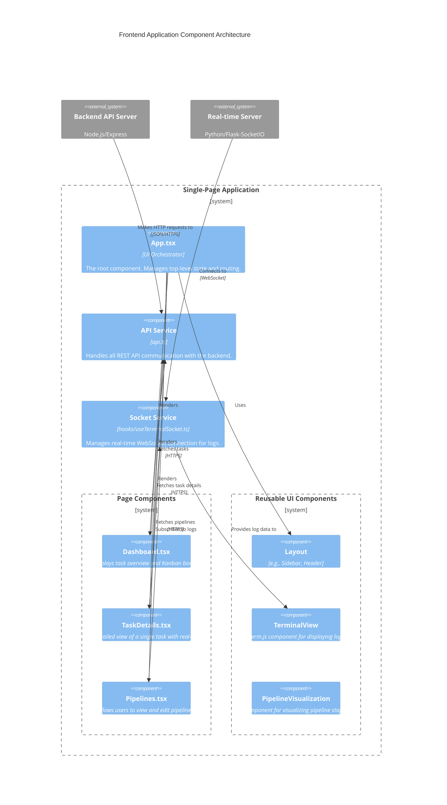

# Client-Side Architecture: A Deep Dive

This document provides an exhaustive description of the frontend architecture for the Agent Orchestration platform. The client is a modern, responsive Single-Page Application (SPA) engineered with React and TypeScript, and built using Vite. It serves as the primary human-computer interface for the entire system, designed to be both highly interactive and maintainable.

### Architectural Philosophy

The client-side architecture is guided by a philosophy of simplicity, clarity, and separation of concerns. Rather than adopting a heavy, all-encompassing framework, the architecture uses a curated set of tools and patterns that are fit-for-purpose.

-   **Component-Based UI:** The user interface is composed of small, reusable, and encapsulated React components. This promotes consistency and accelerates development.
-   **Pragmatic State Management:** The application favors local component state (`useState`, `useReducer`) and controlled prop-drilling for managing UI state. This avoids the premature complexity of a global state management library like Redux or MobX, keeping the data flow explicit and easy to trace. Global state is only considered when state needs to be shared between deeply nested, unrelated components.
-   **Service Layer Abstraction:** All communication with backend APIs is strictly isolated within a dedicated "service layer" (`api.ts`). Components do not make direct HTTP requests; they call functions from the service layer. This decouples the UI from the specifics of the backend API, making the application more resilient to API changes and easier to test.
-   **Encapsulation of Complex Logic via Hooks:** Complex, reusable, stateful logic (such as managing a real-time WebSocket connection) is encapsulated in custom React Hooks (`useTerminalSocket.ts`). This allows sophisticated functionality to be shared across different components in a clean, declarative way.
-   **Centralized, State-Driven Routing:** The application employs a simple and effective internal routing mechanism managed by the root `App` component. Navigation is driven by state changes, not by a complex routing library, which is well-suited to the application's current navigational structure.

***

### C4-Style Component Diagram for the Frontend

This diagram illustrates the main building blocks of the React application and their relationships.



***

### Exhaustive Component & Module Breakdown

#### `main.tsx` - The Application Entry Point
-   **Responsibility:** This is the first file to be executed. Its sole purpose is to import the root `App` component and render it into the `index.html` DOM. It sets up the React application root.

#### `App.tsx` - The UI Orchestrator
-   **Responsibility:** This is the most important component in the frontend architecture. It acts as the central controller for the entire user interface.
-   **State Management:** It holds the highest level of UI state, including:
    -   `selectedSection`: A string that determines which "page" is currently visible.
    -   `currentTaskId`: The ID of the task being viewed, which is `null` unless the user is on the task details page.
-   **Routing:** It implements a simple but effective routing mechanism using a `switch` statement within its `renderSection` function. When `selectedSection` changes (e.g., from `'dashboard'` to `'pipelines'`), this component re-renders and swaps the visible page component. This state-driven approach avoids the need for a URL-based routing library, simplifying the application logic.
-   **Prop Drilling:** It passes down state and state-mutating functions (callbacks) to its children. For example, it passes the `handleViewTask` function to the `DashboardPage`, allowing a child component to tell the root orchestrator to change the view.

#### `src/pages/` - Page-Level Components
-   **Responsibility:** Each component in this directory represents a full "page" or a major functional area of the application. These components are typically stateful and are responsible for fetching the data they need to display.
-   **Example (`Dashboard.tsx`):**
    -   Upon mounting, it uses a `useEffect` hook to call the `fetchTasks()` function from the `api.ts` service.
    -   The fetched tasks are stored in its local state using `useState`.
    -   It renders the list of tasks, perhaps organizing them into columns (e.g., Kanban board).
    -   It accepts the `onViewTask` function as a prop from `App.tsx` and attaches it to a "View" button on each task. When clicked, it notifies the `App` component to switch to the `TaskDetails` page.

#### `src/components/` - Reusable UI Components
-   **Responsibility:** This directory contains a library of smaller, often stateless ("dumb") components that are used to build the pages. They receive data and callbacks via props and are not concerned with data fetching.
-   **Structure:**
    -   `layout/`: Contains high-level structure components like `Header`, `Sidebar`, and a main `Layout` wrapper. The `Sidebar` component, for instance, receives the `selectedSection` to highlight the active item and a `onSelect` callback to notify `App.tsx` of navigation changes.
    -   `sections/`: More complex components that make up parts of a page, like `ActiveSessions`.
    -   `terminal/`: Contains the `Terminal` component, a wrapper around Xterm.js for displaying real-time log output.
    -   `PipelineVisualization.tsx`: A specialized component that takes pipeline data and renders it as a graph using `reactflow`.

#### `src/api.ts` - The Service Layer
-   **Responsibility:** This module is the sole point of contact between the frontend application and the backend REST API. It abstracts away all the details of `fetch`, headers, and URL endpoints.
-   **Benefits:**
    1.  **Decoupling:** Page components don't care if the backend is REST, GraphQL, or something else. They just call a function like `fetchTasks()`.
    2.  **Centralization:** All API endpoints are defined in one place, making them easy to find, update, and debug.
    3.  **Type Safety:** It provides strongly typed functions, ensuring that the payload sent to the backend and the data received from it match the expected TypeScript types.
-   **Example Function:**
    ```typescript
    export async function fetchTasks() {
      const response = await fetch('/api/tasks');
      // Includes error handling and JSON parsing
      return parseJson(response);
    }
    ```

#### `src/hooks/useTerminalSocket.ts` - Real-time Logic Encapsulation
-   **Responsibility:** This custom hook encapsulates the entire lifecycle and logic of managing the WebSocket connection for a task's log stream.
-   **Internal Logic:**
    1.  It accepts a `taskId` as an argument.
    2.  It uses a `useEffect` hook to establish a connection to the Flask-SocketIO server when the component mounts (or when the `taskId` changes).
    3.  Upon connection, it sends a `join-task` event to the server to subscribe to the specific task's log room.
    4.  It registers a listener for the `agent-log` event. When a message is received, it appends it to an internal state array of logs.
    5.  The `useEffect` hook's cleanup function is responsible for disconnecting the socket when the component unmounts, preventing memory leaks.
    6.  The hook returns the array of log messages, which the consuming component (e.g., `TaskDetails`) can then render.

### Key Data Flow Scenarios

#### Scenario 1: Application Load and Initial Page View
1.  **Bootstrap:** `main.tsx` renders `<App />` into the DOM.
2.  **Initial State:** `App.tsx` initializes with `selectedSection: 'dashboard'`.
3.  **Render:** The `renderSection()` function in `App.tsx` returns the `<DashboardPage />` component.
4.  **Data Fetch:** The `DashboardPage` component mounts. Its `useEffect` hook triggers, calling the `fetchTasks()` function from `api.ts`.
5.  **API Request:** `api.ts` executes a `GET /api/tasks` request to the backend.
6.  **State Update:** When the data returns, `DashboardPage` calls its state setter (`setTasks(...)`), triggering a re-render.
7.  **Display:** The `DashboardPage` now renders the fetched tasks to the user.

#### Scenario 2: Viewing a Task's Details with Real-time Logs
1.  **User Action:** The user clicks a "View" button on a specific task within the `DashboardPage`.
2.  **Callback Chain:** The `onClick` handler calls the `onViewTask(taskId)` function that was passed down as a prop from `App.tsx`.
3.  **Orchestrator State Change:** Inside `App.tsx`, the `handleViewTask` function updates two state variables: `setCurrentTaskId(taskId)` and `setSelectedSection('task-details')`.
4.  **App Re-render:** The state change causes `App.tsx` to re-render. This time, its `renderSection()` function returns the `<TaskDetail taskId={currentTaskId} />` component.
5.  **Detail Page Mount:** The `TaskDetail` component mounts. It receives the `taskId` as a prop.
6.  **Data Fetch and Subscription:**
    -   It may call `fetchTaskExecutions(taskId)` from `api.ts` to get historical data.
    -   Crucially, it calls the `useTerminalSocket(taskId)` hook.
7.  **Real-time Connection:** The `useTerminalSocket` hook establishes a WebSocket connection, joins the `taskId` room, and starts listening for `agent-log` events.
8.  **Live Updates:** As the backend worker sends logs to the real-time server, the hook receives them and updates its internal state. This causes the `TaskDetail` component to re-render, displaying the new log lines in the `TerminalView` component in real-time.
9.  **Cleanup:** When the user navigates away (e.g., back to the dashboard), the `TaskDetail` component unmounts. The cleanup function in the `useEffect` inside `useTerminalSocket` runs, disconnecting the WebSocket.
